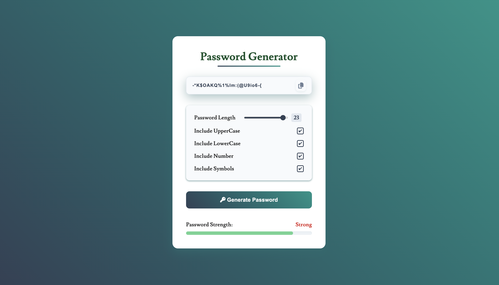

# 🔐 Password Generator

A sleek and responsive password generator built using **HTML**, **CSS**, and **JavaScript**. This tool allows users to generate secure passwords based on selected criteria like length, uppercase, lowercase, numbers, and symbols.

## 🚀 Features

- ✅ Generate random passwords with customizable length
- ✅ Toggle options for:
  - Uppercase letters
  - Lowercase letters
  - Numbers
  - Symbols
- ✅ Real-time password strength meter
- ✅ One-click copy to clipboard
- ✅ Responsive and modern UI

## 🖼️ Preview

  the path -->

